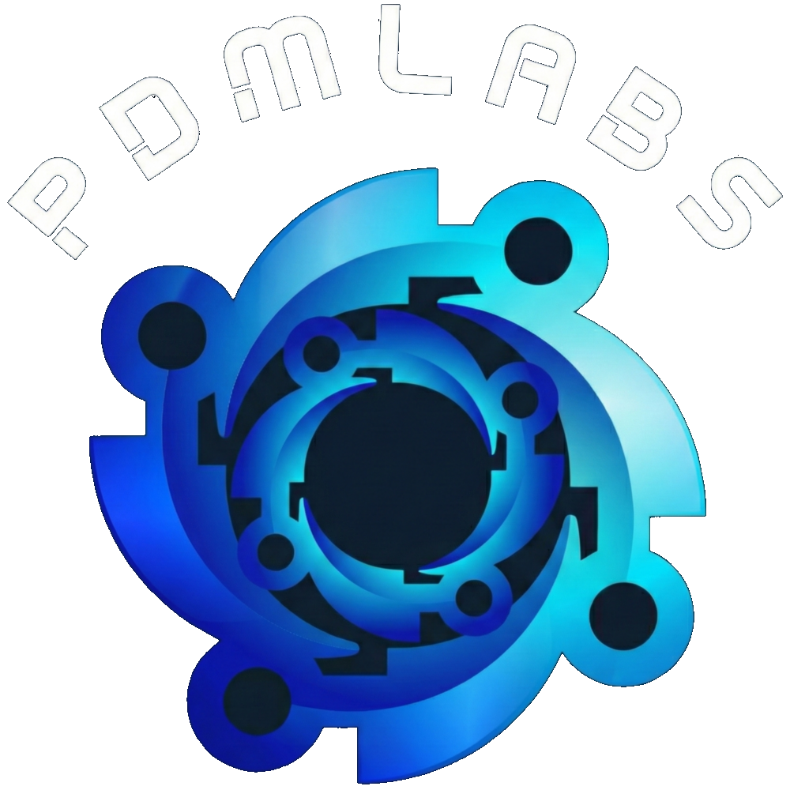

# PdMLabs

<p align="center">
  
</p>
<!-- Update logo path if available -->

**PdMLabs** is a open-source Python automated machine learning benchmarking platform designed to navigate industrial time-series data. It bridges the gap between predictive maintenance (PdM) research and industrial scalability by unifying diverse predictive approaches into a single experimentation framework.

Predictive maintenance is not a single monolithic problem, but a complex task requiring a diverse set of modelling approaches tailored to context. PdMLabs encompasses four fundamental pillars to address the intrinsic complexity of industrial time-series data:

1. **Time-Series Anomaly Detection (TSAD):** Identifies deviations in telemetry that indicate incipient faults. Supports Historical, Online, Sliding, and fully Unsupervised evaluation.
2. **Classification:** Leverages the continuous probabilistic output of supervised classifiers as a proxy for asset health over time.
3. **Remaining Useful Life (RUL):** A regression challenge aimed at predicting the precise time remaining until an asset fails.
4. **Survival Analysis:** A probabilistic approach modeling time-to-event data that gracefully handles "censored" data to estimate survival functions over time.

## 📖 Documentation
For comprehensive guides, API reference, and concepts, check out our [official documentation](https://PdM-Labs.github.io/PdMLabs/).

## 🚀 Quick Start

### Installation

```bash
pip install cython
pip install .
# Or if published to PyPI: pip install pdmlabs
```
**Requirements**: Python >= 3.11

### Basic Usage Example

PdMLabs standardizes evaluation across all pillars. Here is how you load a dataset and orchestrate an experiment:

```python
import pandas as pd
from pdmlabs.utils.dataset import Dataset
from pdmlabs.experiment.batch.auto_profile_semi_supervised_experiment import AutoProfileSemiSupervisedPdMExperiment
from pdmlabs.RunExperiment import run_experiment
from pdmlabs.method.isolation_forest import IsolationForest
from pdmlabs.method.lof_semi import LocalOutlierFactor

# 1. Load your dataset
df = pd.read_csv("data/ims.csv")
dataset_handler = Dataset(df, datetime_column="timestamp", train_sources=0.6, val_sources=0.2, test_sources=0.2)

# Extract the appropriate dataset format for your task (Unsupervised, RUL, Classification, etc.)
Train_Val_data, Train_Test_data = dataset_handler.get_unsupervised_dataset() 

# 2. Define your experiment flavor
experiments = [AutoProfileSemiSupervisedPdMExperiment]
experiment_names = ['My TSAD Experiment']

# 3. Define the methods to test and their hyperparameter search spaces
methods = [IsolationForest, LocalOutlierFactor]
param_space_dict_per_method = [
    {'n_estimators': [200, 100], 'max_samples': [200, 100], 'random_state': [42], 'max_features': [0.8, 0.5], 'bootstrap': [True, False]},
    {'n_neighbors': [2, 3, 5, 10, 20]}
]
method_names = ["IF", "LOF"]

# 4. Execute the experiment (Hyperparameter tuning + Evaluation + MLflow Logging)
best_params = run_experiment(
    dataset=Train_Val_data, 
    methods=methods, 
    param_space_dict_per_method=param_space_dict_per_method, 
    method_names=method_names,
    experiments=experiments, 
    experiment_names=experiment_names,
    MAX_RUNS=4, 
    MAX_JOBS=1, 
    INITIAL_RANDOM=1,
    fit_size=1000, 
    mlflow_port=8080 # Starts an MLflow UI server locally
)
```

## 📊 Cross-Evaluation & Metrics
Evaluating PdM models requires moving beyond simple accuracy due to the inherently imbalanced nature of industrial data. PdMLabs utilizes a comprehensive set of metrics adapted to each modeling task, including AUC-PR, F1-Score, RMSE, MAPE, Concordance Index, and Integrated Brier Score (IBS). 

A unique feature of PdMLabs is the cross-evaluation between RUL and Survival Analysis models (inspired by [TITEUF SYSTEM](https://github.com/agiannoul/TITEUF/tree/main)). PdMLabs seamlessly calculates Survival Analysis metrics for deterministic RUL predictions, and conversely, calculates regression metrics from survival probabilities. 

## 🔍 Explore Results with MLflow
Hyperparameter search is integrated directly into experiments via Mango (Bayesian or random search). MLflow logging is deeply integrated in the run lifecycle. For every successful experiment, PdMLabs logs all metrics and the **best, fully-fitted pipeline** as an MLflow `pyfunc` model.

To view your logged experiments, start the MLflow UI:
```bash
mlflow server --host localhost --port 8080
```
Then navigate to `http://localhost:8080` in your browser.

## 🤝 Contributing
You can easily extend PdMLabs by injecting custom evaluators, models, preprocessors, or postprocessors by inheriting from their respective framework interfaces (e.g. `MethodInterface`, `EvaluatorInterface`). Check out our [Implementing Methods Guide](https://PdM-Labs.github.io/PdMLabs/user-guide/implementing-methods/) for more information.

## 📄 License
This project is licensed under the Apache License, Version 2.0. See the `LICENSE.txt` file for details.